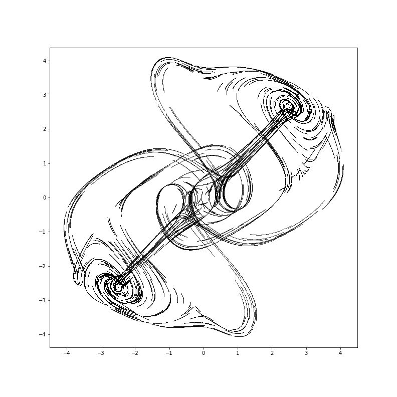

# Thomas' cyclically symmetric attractor

- http://rreusser.github.io/strange-attractors/#thomas  
- https://en.wikipedia.org/wiki/Thomas%27_cyclically_symmetric_attractor  
- http://sprott.physics.wisc.edu/pubs/paper302.pdf

