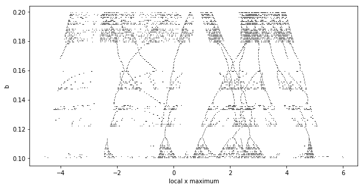
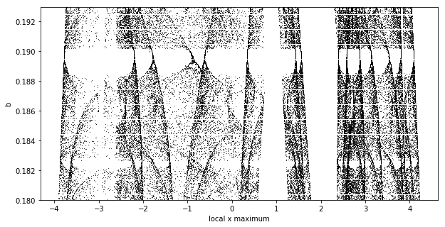

# Thomas' cyclically symmetric attractor

## Links and references

- [http://rreusser.github.io](http://rreusser.github.io/strange-attractors/#thomas) Splendide visualization of different attractors using WebGL
- [wikipedia page of Thomas' attractor](https://en.wikipedia.org/wiki/Thomas%27_cyclically_symmetric_attractor)
- [Labyrinth Chaos, J. C. Sprott et al., 2007](http://sprott.physics.wisc.edu/pubs/paper302.pdf)

- [L’attracteur de Lorenz, paradigme du chaos - E. Ghys](http://www.bourbaphy.fr/ghys.pdf) 

## Thomas' attractor

A simple equation:

        $$
        \dot x = sin(y) - bx \\
        \dot y = sin(z) - by \\
        \dot z = sin(x) - bz
        $$

## Notebooks

- [test numba and optimization](./test_numba.ipynb)
- [ODE solver test](./which_solver.ipynb)
- [what value for coefficient b](./route_to_chaos.ipynb):

